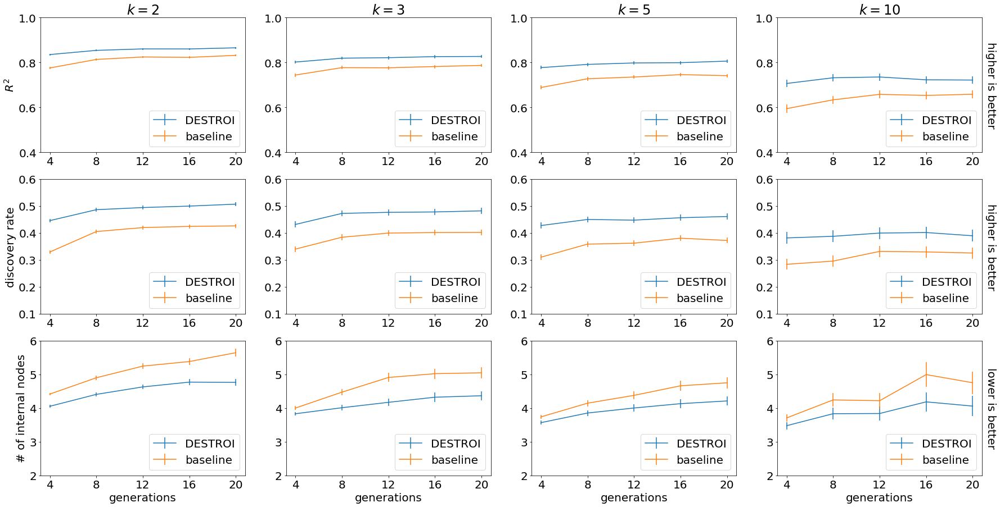
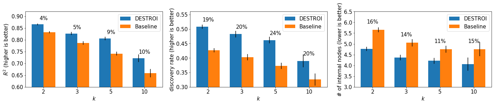
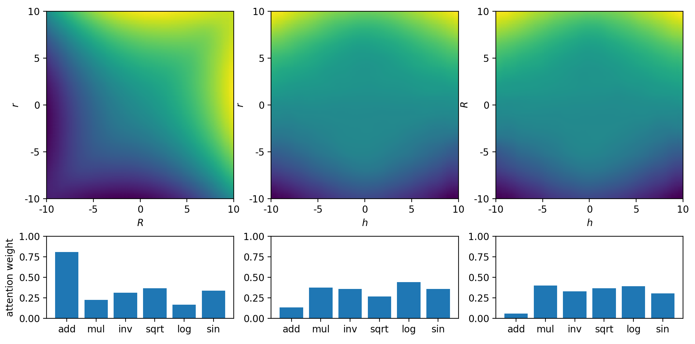
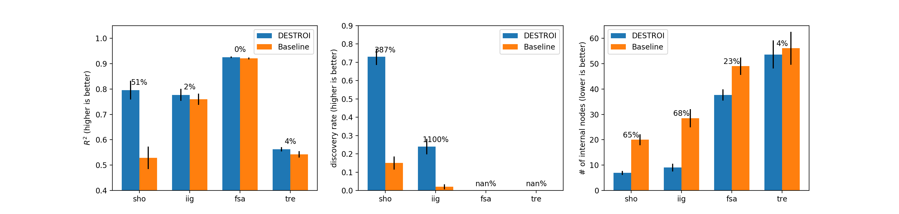

# Deep Symbolic Tree Operator Identificator (DeSTrOI)

We provide the code and results for our DeSTrOI model. The program is developed with python 3.7. The main component of our deep learning model is developed with TensorFlow 2.2.0 and Keras 2.3.1. Please install all the relevent packages with the following command prior to usage. We also use GPU to train our deep learning models. Make sure to also install tensorflow-gpu 2.0.0 if you would like to use GPU.

```bash
pip install -r requirements.txt
```

We provide the following modules:

1. Synthetic data generation
2. Model training
3. Model prediction and evaluation
4. Symbolic regression
5. Experiments
6. Plotting
7. Baseline models
8. Extensions

If you would like to reproduce our graphic results in the paper, you can go direcly to the Plotting section. We have provided the results and performance scores on our dataset in the `/results` directory. We have also provided our [pretraind weights](https://drive.google.com/drive/folders/1L0KR9uZQP60RYcSys1S-thXJ444FDnCh?usp=sharing). you can download them from this anonymized Google Drive save them into `/weights`. 

The raw dataset is not included because of size limitation. The technical appendix contains a detailed description of the data generation method and some summary statistics for our dataset. If you wish to train your own model and perform evaluation, you can follow the steps starting from Synthetic data generation. You can skip the model training step if you wish to use our pretrained weights.

## 1. Synthetic data generation

You can use the following command to generate a synthetic dataset.

```bash
python3 -m data_generation.generate_data
```

You can change the data generation parameters in `/common/preset.py`, including number of tree instances, number of (x y) pairs for each instance, and number of explanatory variables, etc. The dataset will be saved to an H5 file in `/data` by default. For more than 2 explanatory variables, the script creates a projection for each pair of the variables. The program also splits the data into training, validation and testing sets. You can also specify the proportion of each set in `common/preset.py`.

## 2. Model training

You can train the entire model with the synthetic dataset via:

```bash
python3 -m pipeline.training  [-h] [--path PATH] [--encoder ENCODER]
                              [--encoder_path ENCODER_PATH]
                              [--decoder_path_template DECODER_PATH_TEMPLATE]
                              [--batch_size BATCH_SIZE]
```

The `path` argument specifies the dataset path; `encoder` specifies the encoding scheme; `encoder_path` and `decoder_path_template` specifies the location where the model weights is saved. These all have default values in `/common/preset.py`. By default, the super-resolutiuon encoder is used and model weights are saved to `/weights`. We provide our hyperparameters in `/common/preset.py` as described in the technical appendix. Besides this script, you can also choose to train the encoder and decoder separately.

#### encoder

We provide two encoding schemes: super-resolution and MLP. Since the MLP networks do not share weights across instances, there is no separate training phase. For super-resolution, you need to first generate the naive encoding and ground truth encoding for each instance in the dataset. This can be achieved by running:

```bash
python3 -m encoder.super_resolution.prepare_dataset
```

The encoding pairs are then saved to the SUPERR_PATH (configurable in `/common/preset.py`). You can then perform the training with:

```bash
python3 -m encoder.super_resolution.train_encoder
```

All the hyperparameters can be adjusted in `/common/preset.py`.

#### decoder

The decoder can be trained with:

```bash
python3 -m decoder.train_decoder [op_index]
```

Here you need to provide the operator index as an argument. The default correspondance between indices and operators is: 1 -> add, 2 -> mul, 3 -> inv, 4 -> sqrt, 5 -> log, 6 -> sin. The hyperparameters can be adjusted in `/common/preset.py`. Please make sure that the encoder has been run to generate the encodings before training the decoder. If you use the MLP encoder, please change the ENCODING_SCHEME in `/common/preset.py` to "MLP". 

## 3. Model prediction and evaluation

After training, you can generate predictions on the dataset with:

```bash
python3 -m pipeline.prediction  [-h] [--path PATH] [--encoder ENCODER]
                                [--encoder_path ENCODER_PATH]
                                [--decoder_path_template DECODER_PATH_TEMPLATE]
                                [--batch_size BATCH_SIZE]
```

The `path argument` specifies the dataset path; `encoder` specifies the encoding scheme; `encoder_path` and `decoder_path_template` specifies the location where the model weights is loaded. These all have default values in `/common/preset.py`. The model predictions in terms of operator importance scores are saved to the same H5 file as the dataset. The program also prints the model performance on the given dataset including accuracy and AUC scores. We have included the model performance on our dataset in `/results/model`. Besides this script, you can also choose to run and evaluate the encoder and decoder separately.

#### super-resolution encoder

The following scirpt runs the super-resolution encoder and saves the output encodings in the SUPERR_PATH. 

```bash
python3 -m encoder.super_resolution.run_encoder
```

You can then evaluate the encoder using the script below. The predicted encodings are compared to the ground truth and the mean absolute error value will be printed.

```bash
python3 -m encoder.super_resolution.evaluate_encoder
```

#### MLP encoder

The following scirpt runs the MLP encoder and saves the output encodings in the MLP_ENCODER_PATH (also configurable in `/common/preset.py`). 

```bash
python3 -m encoder.MLP.run_encoder
```

#### decoder

You can use the following scirpts to run and evaluate the decoder. The predictions are saved to DATA_PATH. The second script prints the test accuracy and AUC scores for all the operators. These values are also saved to `/results/model`. Please make sure that the encoder has been run to generate the encodings before running the decoder. If you use the MLP encoder, please change the ENCODING_SCHEME in `/common/preset.py` to "MLP". 

```bash
python3 -m decoder.run_decoder
python3 -m decoder.evaluate_decoder
```

## 4. Symbolic regression

After the model predictions are generated, you can run the symbolic regression with genetic programming via:

```bash
python3 -m SR.run_genetic
```

The result (in terms of the best fitting tree and R^2 score) is saved to `/results/SR` by default. We have already provided the result on our synthetic dataset in this directory. Refer to the plotting section on how to visualize the results.

## 5. Experiments

You can use the following program to run the experiments for real physics and mathematics formulas as described in the paper. 

```bash
python3 -m experiment.run_experiment  [-h] [--formula FORMULA] 
                                      [--path PATH] [--encoder ENCODER] 
                                      [--encoder_path_template ENCODER_PATH_TEMPLATE] 
                                      [--decoder_path_template DECODER_PATH_TEMPLATE] 
                                      [--batch_size BATCH_SIZE]
```

You should specify the name of the formula with the `formula` argument. The availavle options are: "sho", "iig", "fsa", "tre". The `path` argument specifies the location where the experiment data and results are saved. `encoder` specifies the encoding scheme. `encoder_path_template` and `decoder_path_template` specifies the location where the model weights is loaded. All arguments except for `formula` have default values in `/common/preset.py`. This script generates (x, y) pairs based on the formula and runs our DeSTrOI pipeline. It prints the predicted importance score for each of the operators. For higher dimensional data, it also saves the attention weights for each projection. The generated data and result for all our formulas have been provided in `/data/experiment`. Refer to the Plotting section on how to visualize these encodings.

With the predictions ready, you can now run genetic algorithm to discover the formula with:

```bash
python3 -m experiment.run_genetic [-h] [--formula FORMULA] [--path PATH] 
                                  [--result_path RESULT_PATH]
```

You should specify the name of the formula with the `formula` argument. The `path` argument specifies the location where the experiment data is saved. The `result_path` argument specifies the location where the experiment results are saved. All arguments except for `formula` have default values in `/common/preset.py`. We have provided our results in `/results/experiment`. Refer to the Plotting section on how to visualize the performance.


## 6. Plotting

#### Symbolic regression

You can visualize the performance of DeSTrOI as applied to symbolic regression with one of the following commands:

```bash
python3 -m plot.plot_SR_result [-h] [--path_template PATH_TEMPLATE]
python3 -m plot.plot_SR_result_at_gen [-h] [--path_template PATH_TEMPLATE] [--gen GEN]
```

The `path_template` argument specifies the location of the experiment data file (with `/data/experiment` as default). The first command plots the comparison across all generations of our genetic algorithm:



For the second command, you need to additionally specify a generation number (one of 4, 8, 12, 16, 20). It uses a bar plot to show the comparison at this specific generation. For the 20th generation, for example:



You should be able to witness a significant performance improvement using our model as compared to the baseline.

#### Experiment

You can visualize the encodings generated for one of our experiment formulas by:

```bash
python3 -m plot.plot_experiment_encodings [-h] [--formula FORMULA] [--path PATH]
```

`path` specifies the location where the experiment data is saved (with `/data/experiment` as default). `formula` specifies the name of the formula you wish to visualize. The script plots all encodings (and attention weights for more than 2 explanatory variables). For fsa, for example:



You can visualize the performance of our model on the experiment formula by running:

```bash
python3 -m plot.plot_experiment_result [-h] [--path_template PATH_TEMPLATE]
```

`path_template` specifies the location where the experiment result for symbolic regression is saved (with `/results/experiment` as default). Using our provided results, the graph is:




Note that we obtaib nan values for the fsa and tre formulas. This is because neither DeSTrOI or the baseline algorithm can discover the true formula.


## 7. Baseline models

We also provide the code for running and evaluating our two baseline models. Use the following scripts for the GA and MLP baselines. For MLP, you need to specify the operator index. By default, the baseline performance results are saved to `/results/baseline`. These are not provided with the code because of size limitation.

```bash
python3 -m baseline.GA_baseline
python3 -m baseline.MLP_baseline [op_index]
```

## 8. Extensions

* Our model can be easily extended to new symbolic operators. You can add operators to the OPERATOR_LIST at the beginning of `/common/symbolic_tree.py`. Then, add corresponding entries in the OPERATOR_ARGS. This maps each operator to its arity (number of argument it takes). 
* You can test on new experiments by adding a formula in `/experiment/formulas.py`.
* You can try different number of explanatory variables (k). Modify NVAR in `/common/preset.py` to do so.

